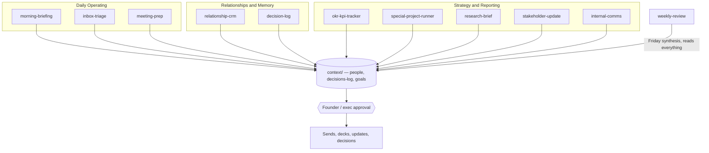

# Operator OS

This is the Claude Code system I run my own operating work through. I'm sharing it because I think it says more about how I'd work in your founder's office than a CV can.

## Why I'm sending you a repo instead of just a CV

I've built four companies from scratch, two of them past six figures. Right now I run Autoage AI, where I build AI systems that generate pipeline, and I run the sales number behind them myself. I'm not the person who briefs an AI and waits. I'm the person who builds the system, uses it every day, and owns what it produces.

This repo is proof of that, not a claim of it. It's the actual operating system I use to run my priorities, my meetings, my decisions, and my relationships, day to day, right now. I stripped out anything private and dropped in fictional example data so you can see it work without seeing my actual business. Everything else, the structure, the skills, the way it thinks, is real.

If you're hiring for a Chief of Staff, Founder's Associate, or Founding Operator role, this is the closest thing I have to "here's how I'd show up in week one."

## System map

Every skill reads and writes the same shared memory layer, and nothing produced here reaches a stakeholder without a human approval step. That gate is the point, not an afterthought bolted on:

## What's inside

A Claude Code project: a `CLAUDE.md` identity file, a `context/` layer for goals, people, and decisions, and 11 skills that do the actual work.

**Daily operating:**

| Skill | What it does |
|---|---|
| `morning-briefing` | Calendar, tasks due, goal alignment, and a quick urgent-only inbox pass, one short brief |
| `inbox-triage` | The deeper pass `morning-briefing` doesn't do: full inbox sorted into reply-now / review / noise, learns sender routing over time |
| `meeting-prep` | Pulls attendee history and open items before a meeting, then a debrief step after it that feeds the next prep |
| `weekly-review` | What decisions got made, what's still open, what needs escalating before it slips into next week |

**Relationships and memory:**

| Skill | What it does |
|---|---|
| `relationship-crm` | Living memory per stakeholder, with staleness tiers so a quiet relationship gets flagged before it's a problem |
| `decision-log` | Records decisions and why, and stops you before you re-decide something that contradicts a past entry |

**Strategy and reporting:**

| Skill | What it does |
|---|---|
| `okr-kpi-tracker` | Sets objectives, breaks each one into the metrics that actually drive it, flags drift down to the specific cause |
| `stakeholder-update` | Board decks, investor emails, or internal updates, each in the format that audience actually reads |
| `special-project-runner` | Scopes a cross-functional project, tracks who's actually looped in vs. assumed to be |
| `research-brief` | A weekly competitive digest plus same-day reaction when something happens now |
| `internal-comms` | Status reports, newsletters, incident write-ups, in whatever format the company already uses |

## Why this shape, and where it came from

Most "AI chief of staff" builds I found while researching this are personal inbox-and-calendar tools. Useful, but generic. I built mine around what a Chief of Staff or Founder's Associate actually does: run special projects, prep the founder or the board, keep cross-functional priorities aligned, hold institutional memory so nothing falls through when things move fast.

I didn't invent these skills in a vacuum. Before building, I mapped the real task list this kind of role covers, then researched what's already been built and proven in the Claude Code ecosystem for each one, and adapted the best of what I found rather than reinventing it. A few worth naming:

- `morning-briefing` and `relationship-crm`'s staleness tiers are adapted from Mike Murchison's (CEO of Ada) own AI chief-of-staff system.
- `meeting-prep`'s prep-then-debrief loop, where the debrief feeds the next prep, is adapted from a pattern that won a real agent-tooling hackathon.
- `decision-log`'s core move, surfacing your own past reversal before you re-decide something, is adapted from a second-brain system built specifically to stop people quietly contradicting themselves.
- `special-project-runner`'s RACI and RAG-status structure comes from one of the most widely-used project-management skill libraries in the Claude Code ecosystem.
- `stakeholder-update` uses named investor-relations frameworks (Sequoia's board-meeting format, the "5-15" investor-update format) instead of a generic "write an update" prompt.
- `internal-comms` is adapted from Anthropic's own official internal-comms skill.

That's the actual research discipline behind this repo: know the job, know what's already been built for it, take the best version, don't rebuild what's already solved.

## Tool leverage

None of these are wired to a live tool in this demo, on purpose, everything here runs on the local `context/` files so you can read it without me handing you API keys. But every skill states exactly what it *would* connect to in a real deployment:

| Area | Intended integration |
|---|---|
| Calendar | Google Calendar MCP |
| Email | Gmail MCP |
| Messaging | Slack MCP |
| Meeting transcripts | Granola, Fireflies.ai, or Otter.ai |
| Metrics data | Google Sheets |
| Project tracking | Linear MCP or a Notion database |
| Docs and decks | Google Docs / Slides, or Notion |

## How to look at it

1. Read `CLAUDE.md` first, it's the identity and operating rules file, same idea as a job description for the AI running this system.
2. Read `context/goals.md` for what I'm actually optimizing for right now.
3. Open any skill's `SKILL.md` to see how it thinks, not just what it outputs.
4. `context/role-target.md` is the one file I customize per company, it's how this system gets pointed at a specific founder's office instead of running generically.

## About me

I'm Shamas (Qaz) Hamad. Founder-operator, four ventures, BSc Computer Science. I build AI systems that generate pipeline and I carry the sales number behind them. Full background, testimonials, and other work: [linkedin.com/in/shamas-hamad](https://linkedin.com/in/shamas-hamad).

Happy to walk through any part of this live.
